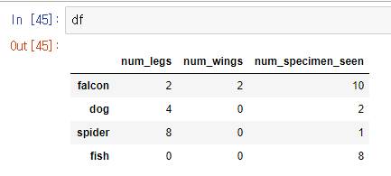
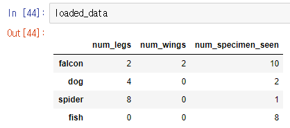

큰 용량의 dataset을 다루다 보면, 중간에 binary file 형태로 저장하고, 이를 나중에 불러와야하는 경우가 있습니다.

가령, Dataset을 불러와서 이리저리 merge하고 전처리를 열심히 했는데, jupyter notebook이 멈추거나, 컴퓨터가 갑자기 꺼지기라도 한다면, 전처리를 다시 수행해야하는데 데이터셋의 size가 작으면 상관없지만, *size가 매우 큰 경우에는 전처리하는 시간이 상당히 오래걸립니다.*

이때 유용하게 사용할 수 있는 python 라이브러리가 바로 **pickle**입니다.


## Pickle 로 데이터 dump (저장) 하기

```python
import pickle
 
save_data = { "name": "john", "color": "red" }
with open( "my_pickle", "wb" ) as file:
    pickle.dump( save_data, file)
```


## 데이터 불러오기

```python
with open( "my_pickle", "rb" ) as file:
    loaded_data = pickle.load(file)
    print(loaded_data)
    
# 출력: {'name': 'john', 'color': 'red'}
```


## DataFrame도 저장하고 불러올 수 있습니다

```python
import pandas as pd
import pickle

df = pd.DataFrame({'num_legs': [2, 4, 8, 0],
                   'num_wings': [2, 0, 0, 0],
                   'num_specimen_seen': [10, 2, 1, 8]},
                   index=['falcon', 'dog', 'spider', 'fish'])  
   
```



> dataframe을 dump

```python
with open( "my_dataframe", "wb" ) as file:
    pickle.dump( df, file)
```


> pickle로 load

```python
with open( "my_dataframe", "rb" ) as file:
    loaded_data = pickle.load(file)
```


> load된 dataframe 출력




정상적으로 잘 출력된 모습을 확인하실 수 있습니다.


