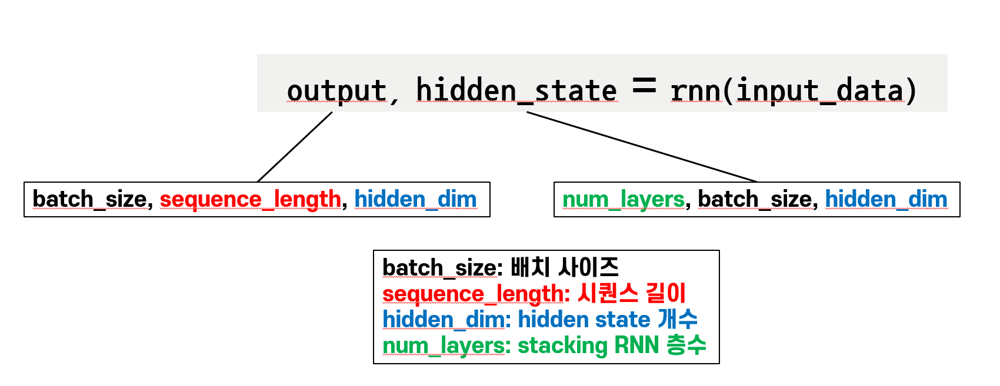

이번 포스팅에서는 pytorch의 `rnn` 레이어의 `input` 차원, `output` 차원, `hidden dimension`, `num_layers` 파라미터를 직접 확인하면서 동작 결과를 눈으로 직접 확인해 보고 코딩시 적절하게 활용하는 방법에 대하여 알아보도록 하겠습니다.

RNN의 동작 원리는 생략하고, 코딩시 입출력 shape에 중점을 두었습니다. 


## PyTorch RNN 파라미터

- 참고: [공식문서](https://pytorch.org/docs/stable/generated/torch.nn.RNN.html)


class `torch.nn.RNN`

- **input_size** – 입력해 주는 특성 값의 개수 입니다. 만약 feature의 개수가 1이라면 `input_size=1`, 입력 feature 개수가 7개면 `input_size=7`을 입력합니다.
- **hidden_size** – hidden state의 개수를 지정합니다. 보통 arbitrary 합니다.
- **num_layers** – RNN 레이어를 겹겹이 쌓아올릴 수 있습니다. RNN 레이어를 쌓아 올리는 것을 `stacking RNN`이라고도 합니다. 만약, 2개층을 겹겹이 쌓아올린다면 `num_layers=2` 로 설정하면 됩니다. 기본 값: `1`
- **batch_first** – 입력으로 받는 데이터의 shape중 첫 번째 차원을 batch로 간주할 것인지를 설정합니다. 일반적으로 pytorch에서 데이터 전처리시 batch를 첫번째 차원으로 지정하기 때문에 많은 케이스에서 `batch_firtst=True` 로 지정함을 볼 수 있습니다.  `True`이면 입력 및 출력 텐서가 (seq, batch, feature) 대신 (batch, seq, feature)로 제공됩니다. 이는 hidden 또는 cell state에는 적용되지 않습니다. 기본값: `False`
- **dropout** – 0이 아닌 경우, 마지막 레이어를 제외한 각 RNN 레이어의 출력에 드롭아웃 레이어를 도입하며, 드롭아웃 확률은 `dropout`과 같습니다. 기본값: `0`
- **bidirectional** – `True`로 설정된 경우, 양방향 RNN을 적용합니다. 기본 값: `False`


## RNN 생성 및 샘플 데이터 생성

> RNN 생성

```python
# 모듈 import
import numpy as np
import torch
import torch.nn as nn

input_size = 1  # 입력 데이터 특성 차원
hidden_dim = 10 # hidden state 차원
n_layers = 2    # stacking layer 개수

rnn = nn.RNN(input_size, hidden_dim, n_layers, batch_first=True)
rnn
# 출력
# RNN(1, 10, num_layers=2, batch_first=True)
```


> 샘플 데이터 생성

```python
# 20개의 시퀀스 생성
seq_length = 20

time_steps = np.linspace(0, np.pi, seq_length*input_size)
print(time_steps.shape)
# 출력
# (20,)

data = np.sin(time_steps)
data.resize((seq_length, 1))
print(data.shape)
# 출력
# (20, 1)

# 배치 차원 추가(0번째)
input_data = torch.Tensor(data).unsqueeze(0).shape
print('Input size: ', test_input.size())
# Input size:  torch.Size([1, 20, 1])
```


## RNN 입출력, hidden 차원 이해

> unsqueeze(0): 0번째 차원 추가. batch 차원을 추가하기 위함

```python
print(torch.Tensor(data).shape)
# torch.Size([20, 1])

print(torch.Tensor(data).unsqueeze(0).shape)
# torch.Size([1, 20, 1])

print(torch.Tensor(np.expand_dims(data, 0)).shape)
# torch.Size([1, 20, 1])
```





> RNN 레이어 input, output, hidden 차원 이해하기

```python
# 배치 차원 추가(0번째)
input_data = torch.Tensor(data).unsqueeze(0) 
print('Input: ', input_data.size())
# input_data 차원
# input: [1, 20, 1]
# Input: [(batch_size, seq_length, input_features)]

# RNN 출력(output, hidden_state)
output, hidden_state = rnn(input_data, None)
# rnn output, hidden_state 차원

# output: [1, 20, 10]
# output: [batch_size(1), sequence_length(20), hidden_dim(10)]
print('Output: ', output.size())
# Output:  torch.Size([1, 20, 10])

# hidden: [2, 1, 10]
# hidden: [num_layers(2), batch_size(1), hidden_dim(10)]
print('Hidden State: ', hidden_state.size())
# Hidden State:  torch.Size([2, 1, 10])
```


> input_size=3, hidden_dim=15, num_layers=2 로 변경시

```python
input_size = 3  # 입력 데이터 특성 차원
hidden_dim = 15 # hidden state 차원
n_layers = 2    # stacking layer 개수

rnn = nn.RNN(input_size, hidden_dim, n_layers, batch_first=True)

# 20개의 시퀀스 생성
seq_length = 20

time_steps = np.linspace(0, np.pi, seq_length*input_size)
print(time_steps.shape)
# (60,)

data = np.sin(time_steps)
data.resize((seq_length, input_size))
print(data.shape)
# (20, 3)

# 배치 차원 추가(0번째)
input_data = torch.Tensor(data).unsqueeze(0)
print('Input size: ', input_data.size())
# torch.Size([1, 20, 3])

output, hidden_state = rnn(input_data, None)

# output shape: [batch_size, sequence_length, hidden_dim]
print('Output: ', output.size())
# Output:  torch.Size([1, 20, 15])

# hidden shape: [num_layers, batch_size, hidden_dim]
print('Hidden State: ', hidden_state.size())
# Hidden State:  torch.Size([2, 1, 15])
```

