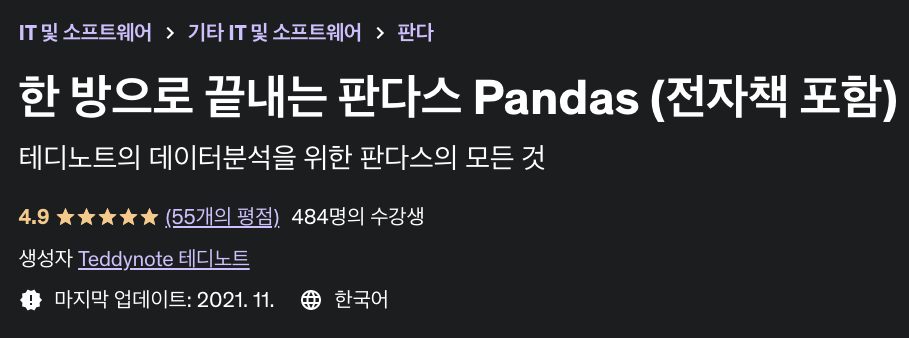
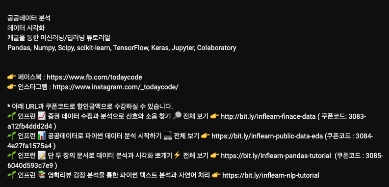

지난 2020년에 작성한 [데이터 분석/인공지능을 공부하려는 분들께 경험을 토대로 학습 방법과 책 추천 (1)](https://teddylee777.github.io/thoughts/%EB%8D%B0%EC%9D%B4%ED%84%B0%EB%B6%84%EC%84%9D-%EC%9D%B8%EA%B3%B5%EC%A7%80%EB%8A%A5-%EC%84%9C%EC%A0%81-%EC%B6%94%EC%B2%9C), 글과 후속 글인 [데이터 분석/인공지능을 공부하려는 분들께 경험을 토대로 학습 방법과 책 추천 (2)](https://teddylee777.github.io/thoughts/%EB%8D%B0%EC%9D%B4%ED%84%B0%EB%B6%84%EC%84%9D-%EC%9D%B8%EA%B3%B5%EC%A7%80%EB%8A%A5-%EC%84%9C%EC%A0%81-%EC%B6%94%EC%B2%9C-2) 을 많이 읽어 주셔서 감사드립니다. 작성 당시에는 가벼운 마음으로 개인적으로 정리를 해보기 위하여 시작하였는데요, 생각보다 많이 읽어 주셔서 놀랐습니다. 다시 한 번 감사하다는 인사 드리고 싶습니다🥹

어느 덧 2020년으로부터 무려 3년이 지나가기도 하고 시중에서 판매되고 있는 책도 3년 전 대비 많은 업데이트가 있었습니다. 시중에 나와 있는 데이터와 인공지능 관련 서적은 빼놓지 않고 거의 다 사서 봤습니다. (물론 전부 완독했다는 의미는 아닙니다 ㅎ) 한 권, 두 권 사모으다보니... 어느 덧 넉넉할 것 같았던 책장이 거의 다 찼네요

 그래서 2023년 새해를 맞아, **2023년 1월 1일 기준**으로 추천 서적 리스트를 업데이트 하고자 합니다 🙌

<u><저도 모든 책을 다 완독하고 추천 드리는 것은 아니니, 참고용으로만 봐주시면 감사하겠습니다></u>

2022년 12월 31일 기준, 유튜브를 포함한 다양한 온라인 교육 플랫폼에 양질의 콘텐츠들이 업로드 되었습니다. 특히, 유튜브에는 고퀄리티의 강의 영상이 넘쳐나고 있습니다. 무료로 양질의 영상으로 학습할 수 있게된 점은 상당히 고무적인데요. 다만, 넘쳐나는 콘텐츠 홍수 속에서 어떤 순서로 학습하면 효율적일지 가이드가 부족해 보였습니다. 그래서 이번 포스팅에서는 콘텐츠 추천과 더불어 수준에 맞는 콘텐츠도 기술해 놓았습니다.

그리고, 궁금 하신 점은 댓글로 남겨 주세요!!

---

## 🔥 데이터 분석

주로 `판다스(Pandas)` 시각화 라이브러리인 `Matplotlib` 과 `Seaborn` 중심으로 기술된 책과 강의 중에서 선발하였습니다.

**난이도**는 아래의 기준으로 표기해 놓았습니다.

- <u>입문자</u> 수준: ⭐️ ~ ⭐️⭐️
- <u>중급자</u> 수준: ⭐️⭐️ ~ ⭐️⭐️⭐️
- <u>상급자</u> 수준: ⭐️⭐️⭐️

---

### Pandas

### 

`Python` 계의 **엑셀(Excel)**로 불리는 만큼 데이터 분석에 있어서 반드시 알아야 하는 라이브러리 입니다. 기본적인 기능인 데이터의 *조회, 정렬, 필터링, 피벗테이블*과 *통계량 산출* 및 *시계열 데이터 분석*에도 막강한 기능을 가지고 있습니다. 다양한 데이터 형태(excel, csv, json, sql table 등)를 다룰 수 있고 대용량 데이터를 다룰 때 엑셀보다 훨씬 더 빠릅니다.  **빅데이터 분석 기사 자격증**에 도전하시는 분들 역시 판다스와 익숙해져야 합니다.

### 시각화

차트, 그래프 또는 맵과 같은 시각적 요소를 사용해 데이터를 표시하는 방법입니다. Python 언어를 활용한 대표적인 시각화 도구는 `Matplotlib`과 `Matplotlib` 기반으로 만들어진 고수준의 라이브러리인 `Seaborn`이 있습니다. 아래 2개의 라이브러리를 모두 활용할 줄 안다면 더할나위 없이 좋겠지만, 입문자는 `Seaborn`부터 먼저 학습하셔도 좋습니다. 

- `Matplotlib`, `Seaborn`

  

### ✨ 한 권으로 끝내는 판다스 노트 - 전자책(wikidocs) & 온라인 강의

- **추천대상**

  - 판다스(Pandas), 시각화(Matplotlib, Seaborn)을 처음 배우고자 하는 **입문자**

- **난이도** ⭐️ ~ ⭐️⭐️

- **전자책**

  - https://wikidocs.net/book/4639

- **강의**

  - [인프런 - 한 방으로 끝내는 판다스(Pandas) 강의](https://www.inflearn.com/course/%ED%85%8C%EB%94%94%EB%85%B8%ED%8A%B8-%ED%95%9C%EB%B0%A9-%ED%8C%90%EB%8B%A4%EC%8A%A4)
  - [Udemy - 한 방으로 끝내는 판다스(Pandas) 강의](https://www.udemy.com/course/pandas-i/)

- **출간일**: 2022년 12월 5일

- **추천이유**

  제가 2022년 12월에 공개한 판다스, 시각화를 다룬 전자책입니다. 전자책이고 <u>무료</u>로 공개했기 때문에 부담 없이 보실 수 있는 책이라 생각합니다 :) 전문 서적과는 다르게 넓은 분야를 모두 다루지는 않고 **사용 빈도가 높은 기능 위주**로 구성하였습니다. 그리고 연습문제를 엄청 많이 넣어놨습니다😆 실습을 바로 해보시고 해설도 공개해 놓았기 때문에 정답을 맞춰가면서 연습해 보시면 좋을 것 같습니다. 해당 전자책과 함께 인프런에서 [한 반으로 끝내는 판다스 강의](https://www.inflearn.com/course/%ED%85%8C%EB%94%94%EB%85%B8%ED%8A%B8-%ED%95%9C%EB%B0%A9-%ED%8C%90%EB%8B%A4%EC%8A%A4)도 들어보실 수 있습니다 🫶

  

  처음 판다스를 배우시는 분들부터 중급 수준으로 다루시는 분들을 위한 강의 입니다. 판다스 처음 접하시는 분들도 부담 없이 수강하실 수 있습니다 ☺️

### 📔 **파이썬 머신러닝 판다스 데이터 분석**

- **추천대상**

  - 판다스(Pandas), 시각화(Matplotlib, Seaborn)을 처음 배우고자 하는 **입문자**

- **난이도** ⭐️

- **출간일**: 2019년 06월 15일

- 구매링크

  - [예스24](http://www.yes24.com/Product/Goods/74258258), [교보문고](https://product.kyobobook.co.kr/detail/S000000833232)

- **추천이유**

  입문자의 눈높이에 맞춘 쉬운 설명과 더불어 예제 실습도 다양한 데이터 형태를 다룹니다. 말그대로 입문자가 처음 1권을 구매한다면, 저는 이 책을 주저하지 않고 추천할 것 같습니다. 다만, 판다스(Pandas)를 조금이라도 다뤄본 적이 있는 탈입문자분들은 다음으로 나오는 책을 보시는 것을 추천 드립니다.

### 💻 오늘코드todaycode

- **YouTube 채널, 소유자: 박조은 님**

- **채널 링크**: https://www.youtube.com/@todaycode

- **난이도** ⭐️ ~ ⭐️⭐️

- **추천대상**

  - 코딩을 어느 정도 할 줄 아는 초/중급자

- **추천이유**

  채널의 소유자이신 박조은 님은 데이터 분석을 한 번이라도 해보신 분이라면 아시는 이름이지 않을까 생각합니다. 그만큼 데이터 분석 관련 콘텐츠들을 많이 공유해 주고 계신 분입니다. 오늘코드 유튜브 채널은 처음 코딩하시는 분들보다, 판다스/시각화 라이브러리와 어느 정도 친숙해진 상태에서 **실전 데이터를 가지고 어떻게 분석에 접근하면 좋을까?** 물음에 답을 얻을 수 있는 채널입니다. 

  

  채널의 재생목록만 봐도 알 수 있듯이 실전 데이터를 활용한 다양한 분석 영상이 재생목록으로 정리되어 있습니다. 설명도 조곤조곤 쉽게 잘 설명해 주십니다👍

  재생목록에서 듣고 싶은 강의 목록을 완강해보세요! 영상은 눈으로만 보지 마시고, **꼭 실습은 직접 손으로 타이핑 해보면서 따라 해보셔야** 합니다 (눈으로 보는 것과 실제로 해보는 것은 정말정말정말 많이 달라요🥺)

  만약, 강의가 마음에 드셨다면, 인프런에 유료로 업로드된 강의도 수강해 보셔도 좋습니다 :) 관심있는 주제가 있다면요! [유튜브 채널 내 정보](https://www.youtube.com/@todaycode/about)란에 강의 링크가 있습니다!

  

### 💻 Pandas로 하는 시계열 데이터분석

- **YouTube 채널, 소유자: SKplanet Tacademy, 강의자: 이홍주 님**

- **채널 링크**: https://www.youtube.com/watch?v=oNLaw2Q8Irw&list=PL9mhQYIlKEhd60Qq4r2yC7xYKIhs97FfC

- **실습링크**: [https://github.com/midnightradio/tsa-tutorial](https://www.youtube.com/redirect?event=comments&redir_token=QUFFLUhqbVNpNDdQTmdVazdfdTVOeElRckNYZjBVNHJYUXxBQ3Jtc0tuU2g4SkExLTZvVUhzSHdTV1phdVF4aVEzZnkzcjNkdlhVTnJOeXlQTUxKdUJhZ0xTNUZkS21SWU41MjdzcnBCZ3BxU3ktNG93TWZZVUlNNWc2M29oaUNsS2tERzNhSWlFZVdlR3hVenM0ZmRCWWk3VQ&q=https%3A%2F%2Fgithub.com%2Fmidnightradio%2Ftsa-tutorial&stzid=UgzlaNkZ4g9WNCvO_sR4AaABAg.8ro12q2xIMR8tF2KWmpDs6) 

- **난이도** ⭐️⭐️

- **추천대상**

  - Python / Pandas를 활용한 시계열 데이터 분석에 관심 있는 분
  - Pandas 문법을 어느 정도 익히신 분

- **추천이유**

  Pandas를 활용한 시계열 데이터 분석을 다루는 강의는 아직 많지 않은 것 같습니다. SKplanet Tacademy에서 공개한 강의는 3년 전 강의 임에도 불구하고, 시계열 데이터만 집중하여 다루기 때문에 추천하였습니다. 강의자님께서 엔지니어 출신이시다 보니 코드 위주로 진행되는 강의입니다. 강의자님께서 실습자료 링크도 공개해 주셨으니, 실습에 활용해 보시기 바랍니다!

### 📌 데잇걸즈2 - Pandas 10분 완성

데잇걸즈2는 과학기술정보통신부와 한국정보화진흥원이 주관하는 SW여성인재 빅데이터 분석 교육과정입니다. 해당 교육과정에서 공개한 튜토리얼이며, 원문인 10 Minutes to Pandas를 번역한 번역본입니다. 판다스의 다양한 기능을 한 페이지로 요약해서 볼 수 있으나, 사실 양이 많긴 합니다 (실제로 10분 안에 완성하긴 쉽지 않아요😂)

- 링크: https://dataitgirls2.github.io/10minutes2pandas/

자주 활용하는 기능들 위주로 나열되어 있으며, 나중에 몇 개의 문법이 기억나지 않는다면, 그 때 찾아보시는 용도로도 좋아요!

### 📌 빅데이터 분석기사 실기 준비를 위한 캐글 놀이터

- **소유자 및 운영자**: 김태헌(Kim Tae Heon) 님

- **링크**: https://www.kaggle.com/datasets/agileteam/bigdatacertificationkr

- **강의**:

  - [인프런 - 빅데이터 분석기사 실기 강의](https://www.inflearn.com/course/%EB%B9%85%EB%8D%B0%EC%9D%B4%ED%84%B0-%EB%B6%84%EC%84%9D%EA%B8%B0%EC%82%AC-%EC%8B%A4%EA%B8%B0)

- **난이도** ⭐️⭐️

- **추천대상**

  - **빅데이터 분석기사 실기 시험**을 준비하는 분들

- **추천이유**

  다양한 *빅데이터 분석 기사 실기 시험용 예제 문제들이 수록*되어 있으며, 시험을 준비하는 다른 분들의 풀이법도 확인할 수 있습니다. 또한, discussion 채널에 모르는 문제에 대한 토론을 진행할 수 있으며, 후기도 확인해 볼 수 있습니다. 

  운영자이신 김태헌 님께서는 캐글 코리아(KaKR) 에서 스터디를 무려 3년 넘게 운영하고 계시고, [퇴근 후 딴짓 유튜브 채널](https://www.youtube.com/@ai-study)도 운영하고 계십니다. 입문자의 수준에 맞게 정말 쉽게 잘 설명해 주셔서 한 번 둘러 보셔도 좋을 것 같습니다. 

### 📌 빅데이터 분석기사 필기/실기, ADsP 데이터분석 준전문가

- **YouTube 채널, 채널명: EduAtoZ - Programming**

- **링크**: https://www.youtube.com/@EduAtoZPython

- **추천대상**

  - 프로그래밍이 <u>처음</u> 이신 분들
  - **빅데이터 분석기사 필기/실기 시험, ADsP 데이터분석 준전문가, Cospro 1, 2급** 준비중인 분들

- **난이도** ⭐️ ~ ⭐️⭐️

- **추천사유**

  빅데이터 분석기사, ADsP, Cospro등 데이터 관련 자격증 강의 영상이 업로드 되어 있습니다. 주로, 자격증 관련 강의는 플랫폼에서 유료로 시청해야 하는 경우가 많은데, 무료로 양질의 콘텐츠를 시청할 수 있는 것이 가장 큰 장점입니다. 설명도 차근차근 입문자의 눈높이에 맞춰 진행합니다. **처음 공부하시는 분들께 적극 추천** 드립니다. 자격증 관련 영상 뿐만 아니라, Pandas 데이터 분석 그리고 머신러닝 알고리즘과 코딩에 대한 설명도 잘 되어 있습니다.

  
