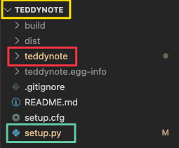

PYPI는 **Python Package Index**의 약어로 **Python 패키지 저장소**의 개념으로 생각하시면 됩니다. 수 많은 개발자들이 본인이 만든 파이썬 소프트웨어를 손쉽게 설치하고 활용할 수 있도록 패키지화 하여 저장소에 업로드를 하는데요. 저장소에 업로드된 패키지를 `pip install 패키지명` 명령어로 손쉽게 설치할 수 있다는 것이 가장 큰 장점입니다.

파이썬에서 `pip` 명령어를 활용하여 **나만의 패키지를 손쉽게 설치할 수 있는 파이썬 패키지(PYPI)**를 만드는 방법과 이를 **PYPI에 등록하고 배포하는 방법**에 대해 알아보겠습니다.


> PYPI 사이트


 **링크**: https://pypi.org/


## PYPI에서 등록하고자 하는 프로젝트명 검색


내가 등록하고자 하는 프로젝트 명이 겹치면 등록이 불가하기 때문에, 사전에 등록하고자 하는 프로젝트명을 검색 후 등록이 가능한지 확인합니다.

아래의 예시에서는 `teddynote` 라는 패키지가 등록 가능한지 검색했는데, 이미 등록이 되어 있기 때문에 해당 이름으로는 등록이 불가합니다. 따라서, 다른 이름을 사용해야 합니다.


이번에는 `teddynote-kr` 이라는 패키지명으로 검색하였습니다.


유사한 이름이 같이 검색되긴 하지만 정확히 일치하는 패키지명이 검색이 되지 않았으니, `teddynote-kr` 이라는 패키지명으로는 등록이 가능합니다.


## PYPI 회원가입

파이썬 패키지를 등록하고 업데이트하기 위해서는 PYPI 계정이 필요합니다. 따라서 아래의 링크에서 간단히 회원가입을 진행합니다.

링크: https://pypi.org/account/register/


## 프로젝트 구성

아래의 예시는 파이썬 패키지명을 `teddynote`로 등록할 때의 예시입니다.



1. **노란색 영역**: 루트(Root) 폴더이자 프로젝트 폴더명입니다. 폴더명은 프로젝트의 이름을 넣으셔도 되고, 다른 폴더명을 지정해도 크게 상관 없습니다(크게 중요하지 않습니다).
2. **빨간색 영역**: 패키지에 등록하고 싶은 패키지명을 일반적으로 지정합니다.
3. **초록색 영역**: `setup.py`가 위치해 있어야 합니다. `setup.py`는 **노란색 영역의 프로젝트 루트폴더 하위에 위치**해야합니다. 우선, 빈 `setup.py` 파일을 생성 후 다음 단계에서 적절한 정보를 채웁니다.
4. 

## `setup.py` 정보 기입

`setup.py` 안에는 다음의 내용을 기입합니다. 아래의 내용 기입시 하단에 세부설명을 읽어보시고, 적절한 내용을 채워주시면 됩니다.

> `setup.py`

```python
from setuptools import setup, find_packages

setup(
    name='프로젝트명',
    version='0.0.1',
    description='PYPI tutorial package creation written by TeddyNote',
    author='teddylee777',
    author_email='teddylee777@gmail.com',
    url='https://github.com/teddylee777/teddynote',
    install_requires=['tqdm', 'pandas', 'scikit-learn', 'lightgbm', 'xgboost', 'catboost', 'optuna'],
    packages=find_packages(exclude=[]),
    keywords=['teddynote', 'teddylee777', 'python datasets', 'python tutorial', 'machine learning', 'deep learning', 'optuna'],
    python_requires='>=3.6
    package_data={},
    zip_safe=False,
    classifiers=[
        'Programming Language :: Python :: 3.6',
        'Programming Language :: Python :: 3.7',
        'Programming Language :: Python :: 3.8',
        'Programming Language :: Python :: 3.9',
    ],
)

```


- `name`: 문자열로 프로젝트명을 기입합니다.
- `version`: 프로젝트의 버전을 입력합니다. 보통 `0.0.1` 형식으로 기입하는데, 버그 수정 정도는 맨 뒤의 버전을 업데이트하고, 작은 기능이 추가되면 중간 숫자를, 아주 중요한 기능 추가나 대규모 변경시에는 첫 번째 위치한 숫자를 업데이트 합니다. 추후 패키지에 수정을 했지만, 버전 업데이트를 하지 않은 경우에는 패키지 업데이트가 안될 수 있으니, 이 점 유의해 주시기 바랍니다.
- `description`: 프로젝트 설명을 기입합니다.
- `author`: 프로젝트 소유자 닉네임을 기입합니다.
- `author_email`: 프로젝트 소유자의 이메일 주소를 기입합니다.
- `url`: 프로젝트의 주소(GitHub)를 기입합니다.
- `install_requires`: 프로젝트 실행을 위하여 사전에 설치되어야 하는 파이썬 패키지 목록을 열거합니다.
- `keywords`: 프로젝트 검색시 노출될 키워드를 등록 합니다.
- `python_requires`: 최소 파이썬 설치 버전을 지정합니다. 3.6 버전 이상을 요구한다면 `>=3.6`이라고 입력할 수 있습니다.


## 패키지 폴더 하위에 `__init__.py` 추가


패키지 폴더 하위에 `__init__.py` 파일을 생성 후 다음과 같이 버전을 입력합니다.

> `__init__.py`

```python
__version__ = '0.0.1'
```

추후 패키지 버전 업데이트 시 `setup.py` 내부에 기입된 버전과 `__init__.py` 버전 모두 업데이트 해야 합니다.


## 패키지 빌드

프로젝트 루트 폴더에서 터미널을 열고 다음의 명령어를 실행하여 `setuptools` 와 `wheel`을 설치합니다.

```bash
pip install setuptools wheel
```


설치가 완료 되었다면, `setup.py` 파일이 위치한 경로에서 다음의 명령어를 실행합니다.

```bash
python setup.py sdist bdist_wheel
```


그럼, 업로드할 수 있는 파이썬 패키지가 wheel로 생성됩니다.


## PYPI 에 패키지 업로드

드디어, 만든 패키지를 업로드 할 차례입니다. 먼저 `twine` 패키지를 설치 합니다.

```bash
pip install twine
```


마지막으로 다음의 명령어를 실행하여 패키지를 업로드 합니다.

```bash
python -m twine upload dist/*
```


업로드시, pypi 사용자의 username과 password를 물어봅니다. 회원가입 후 생성한 email 형식의 아이디와 password를 입력 후 엔터를 치면 정상적으로 업로드가 완료됩니다.


