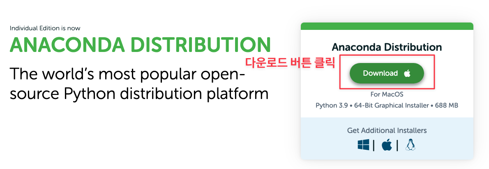

본 포스팅은 **Google TensorFlow Developers Certificate** 자격인증 시험을 위한 환경설치를 위한 내용입니다.

2020년도에 작성한 [**텐서플로우 개발자 자격증 (Tensorflow Developer Certification) 시험 그리고 취득방법**](https://teddylee777.github.io/thoughts/tensorflow-2-certification) 글에서 구글 텐서플로 자격 인증 시험에 대하여 응시 전 준비사항, PyCharm 셋팅, 플러그인 설정 방법을 다뤘습니다.

2년 사이에 PyCharm과 설치할 라이브러리 등이 업데이트 되면서, 기존에 공유 드렸던 내용과 맞지 않아 문의가 많아 **2023년 버전으로 새롭게 업데이트**하게 되었습니다👏👏

<u>주요 내용</u>은 다음과 같습니다.

- <u>STEP 1</u>: 아나콘다(Anaconda) 가상환경 설치
- <u>STEP 2</u>: PyCharm 설치
- <u>STEP 3</u>: 가상환경 생성 후 필요한 라이브러리 설치
- <u>STEP 4</u>: PyCharm에 설치한 가상환경 적용

STEP 2 ~ STEP 4의 내용은 설정과정을 글로 풀어내기 다소 어려운 점이 있어 **유튜브 영상**과 같이 참고하여 진행해 주시면 됩니다.


## STEP 1. 아나콘다 가상환경을 다운로드 후 설치를 진행합니다.



아래 링크를 클릭하여 OS에 맞는 **아나콘다 가상환경을 다운로드 받고 설치를 진행**합니다.

- **Windows**: https://www.anaconda.com/distribution/#windows
- **Mac OS**: https://www.anaconda.com/distribution/#macos

**64-Bit Graphical Installer**를 인스톨하시면 됩니다.


## 아래 YouTube 영상을 참고하여 진행해 주세요! (STEP2 ~ STEP4)

<br>

<iframe width="560" height="315" src="https://www.youtube.com/embed/Sotje18bINY" title="YouTube video player" frameborder="0" allow="accelerometer; autoplay; clipboard-write; encrypted-media; gyroscope; picture-in-picture; web-share" allowfullscreen></iframe>

<br>

1. **가상환경 설치 패키지 목록**

   **영상을 따라서 진행**해 주시면 됩니다만, 설치하는 패키지 목록은 (영상이 아닌) **아래에 표기된 최신 버전**을 설치해 주셔야 합니다.

   **설치에 활용한 패키지 목록 (최신 업데이트 2023. 01. 08)**

   ```bash
   pip install tensorflow==2.9.0
   pip install tensorflow-datasets==4.6.0
   pip install numpy==1.22.4
   pip install Pillow==9.1.1
   pip install scipy==1.7.3
   pip install pandas==1.4.2
   pip install urllib3
   ```

   

2. [**PyCharm 설치 다운로드 링크**](https://www.jetbrains.com/ko-kr/pycharm/download/)


